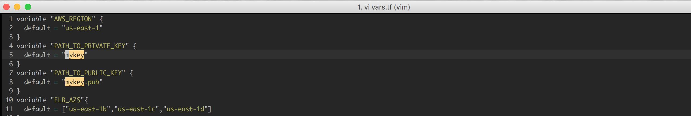
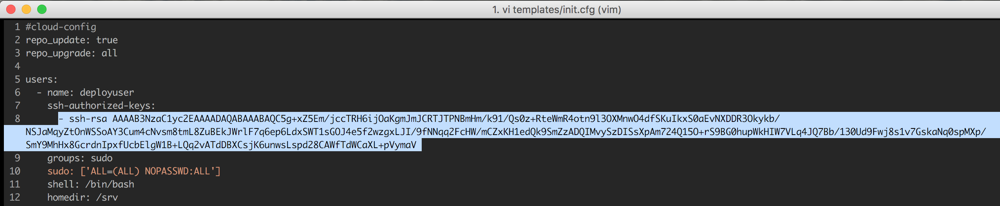
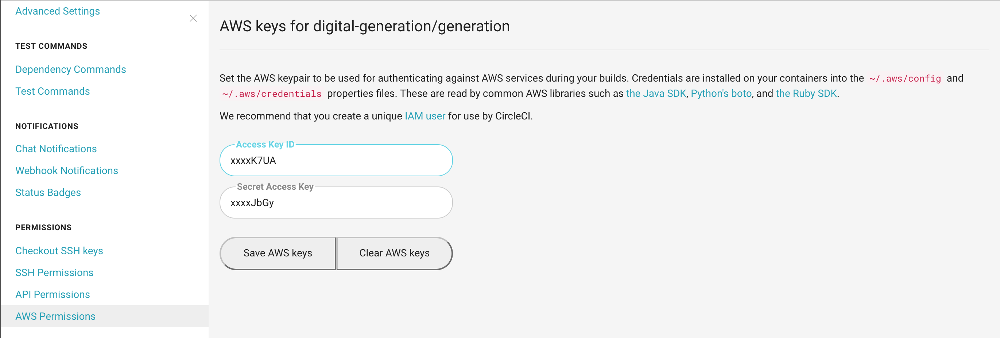

##Installation
Follow this link to install terraform -> https://www.terraform.io/intro/getting-started/install.html

##Configuration
1. [Create IAM user(s)](http://docs.aws.amazon.com/IAM/latest/UserGuide/id_users_create.html#id_users_create_console) with policy `AdministratorAccess` from AWS IAM console of root user. Save the access keys of the user which will be used to create the infra via terraform.
2. Configure aws keys:
   - Install [aws cli](http://docs.aws.amazon.com/cli/latest/userguide/installing.html) and configure by calling `aws configure`
   - The project root contains a file named terraform.tfvars.example. Rename that file to terraform.tfvars and populate it with your AWS credentials:
      
      `$ mv terraform.tfvars.example terraform.tfvars`  
      `$ vim terraform.tfvars`  
      `$ terraform apply -var-file terraform.tfvars`

3. Create ssh keys in the root dir of the repo using command `ssh-keygen` 
   - either in file `mykey` or
   - update the key name in vars.tf if created ssh keys in different file
   
4. Replace key under `ssh-authorized-keys` in templates/init.cfg with your public key generated in file mykey.pub

      
   

## Usage
The plan phase takes your Terraform configuration and attempts to provide you with a plan of what it would do if you applied it.
'terraform plan'

**To execute the terraform script and bootstrap your AWS infrastructure run `terraform apply`**  
   This will output 4 values:
   - EC2 instance public ip
      Use this ip to ssh into the box in order to check logs,config etc  
      `ssh -i mykey deployuser@node-ip`
   - ELB DNS
      Use this DNS to navigate to the sample app.  
      *Note - ELB takes few minutes to set up as the health check interval is set to be 30 sec. You can change this value in elb.tf file*
   - Circle iam user access key & Circle iam user secret key  
     Terraform scripts are creating a circle iam user which has full access to S3 & Codedeploy resources.  
     Copy these keys to your circle project settings so as to set up automatic deployments with every circle build
        

**To destroy the infrastructure created via terraform `terraform destroy`**

## Circle CI Access  
   - Login to Circle using your Github account
   - Navigate to `Add Projects` on Circle Ci dashboard
   - Select your organization
   - Click on `Follow/Build Project` next to your repo
