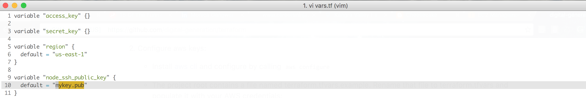

##Installation
Follow this link to install terraform -> https://www.terraform.io/intro/getting-started/install.html

##Configuration
1. [Create IAM user(s)](http://docs.aws.amazon.com/IAM/latest/UserGuide/id_users_create.html#id_users_create_console) with policy `AdministratorAccess` from AWS IAM console of root user. Save the access keys of the user which will be used to create the infra via terraform.
2. Configure aws keys:
   - Install [aws cli](http://docs.aws.amazon.com/cli/latest/userguide/installing.html) and configure by calling `aws configure`
   - The project root contains a file named terraform.tfvars.example. Rename that file to terraform.tfvars and populate it with your AWS credentials:
      
      `$ mv terraform.tfvars.example terraform.tfvars`  
      `$ vim terraform.tfvars`  

3. Create ssh keys in the root dir of the repo using command `ssh-keygen` 
   - either in file `mykey` or
   - update the key name in vars.tf if created ssh keys in different file
   
4. Replace key under `ssh-authorized-keys` in templates/init.cfg with your public key generated in file mykey.pub

      
   

## Usage
1. `terraform plan`  
   The plan phase takes your Terraform configuration and attempts to provide you with a plan of what it would do if you applied it. It compares your current aws state with terraform scripts and outputs resources which are supposed to be added/deleted/modified.

2. `terraform apply`  
   Executes your terraform scripts(files ending with extension .tf) and incrementaly builds your infrastructure.  
   > Note : Some resources are optional, to implement those resources just remove `.sample` from their extension. Similarly add `.sample` to scripts you don't want to implement.
   `terraform apply` will output 4 values:  
   - EC2 instance public ip
      Use this ip to ssh into the box in order to check logs,config etc  
      `ssh -i mykey deployuser@node-ip`
   - ELB DNS
      Use this DNS to navigate to the sample app.  
      _Note - ELB takes few minutes to set up as the health check interval is set to be 30 sec. You can change this value in elb.tf file_
   - Circle iam user access key & Circle iam user secret key  
     Terraform scripts are creating a circle iam user which has full access to S3 & Codedeploy resources.  
     Copy these keys to your circle project settings so as to set up automatic deployments with every circle build
        

3. `terraform destroy`  
   Destroys the infrastructure created via terraform.

## Circle CI Access  
   - Login to Circle using your Github account
   - Navigate to `Add Projects` on Circle Ci dashboard
   - Select your organization
   - Click on `Follow/Build Project` next to your repo

## INFRASTRUCTURE
  
+ `node_vpc`  
   [Virtual Private Cloud](https://aws.amazon.com/vpc/) with subnet CIDR specified in [vars.tf](vars.tf). VPC is divided into 2 subnets - Private & Public, each of them corresponding to a single availability zone. Public subnet has a route to Internet Gateway for it to connect to the internet. For internet connection of resources in private subnet,it has a route to [NAT instance](http://docs.aws.amazon.com/AmazonVPC/latest/UserGuide/VPC_NAT_Instance.html) which is launched in Public subnet.
+ `node_vpc_public_subnet_az` : Availability zone for public subnet, specified in [vars.tf](vars.tf).
+ `node_vpc_private_subnet_az` : Availability zone for private subnet, specifies in [vars.tf](vars.tf).
+ `node_public_subnet`  
   Public subnet with connection to the internet. It has following components :  
     - `node_igw([Internet Gateway](http://docs.aws.amazon.com/AmazonVPC/latest/UserGuide/VPC_Internet_Gateway.html))` : Provides internet connection.
     - `node_elb` : [Elastic Load Balancer](https://aws.amazon.com/elasticloadbalancing/) over EC2 instances launched in private subnet.
     - `node_nat_instance` : EC2 instance launched with NAT AMI. It's required for providing internet connection to EC2 instances in private subnet which needs to install packages. 
     - `node_bastion_instance`(Optional) : Its an optional EC2 instance to be used as a [bastion host](https://aws.amazon.com/blogs/security/how-to-record-ssh-sessions-established-through-a-bastion-host/),which can be used to ssh into EC2 instances in private subnet for debugging purposes. 
+ `node_private_subnet`  
   Private subnet with no direct connection to the internet. It has following components : 
   - `node_instance` : EC2 instance on which application will be deployed.
   - `node_shared_volume`(Optional) : Shared EBS volume mounted to a particular folder in EC2 instance for storing persistent files.
+ `node_s3_bucket` : S3 bucket on which compressed artifacts(revisions) will be pushed from circleci to be available for `node_instance` to fetch and deploy(via CodeDeploy agent).
+ `circle_ci_iam_user` : IAM user attached to CircleCi with write access to S3 bucket and full access to CodeDeploy to push revisions to S3 bucket and use CodeDeploy to deploy the revisions.
+ `deployer(codedeploy_deployer)` : [CodeDeploy](https://aws.amazon.com/documentation/codedeploy/) Application to deploy the code on `node_instance`.
